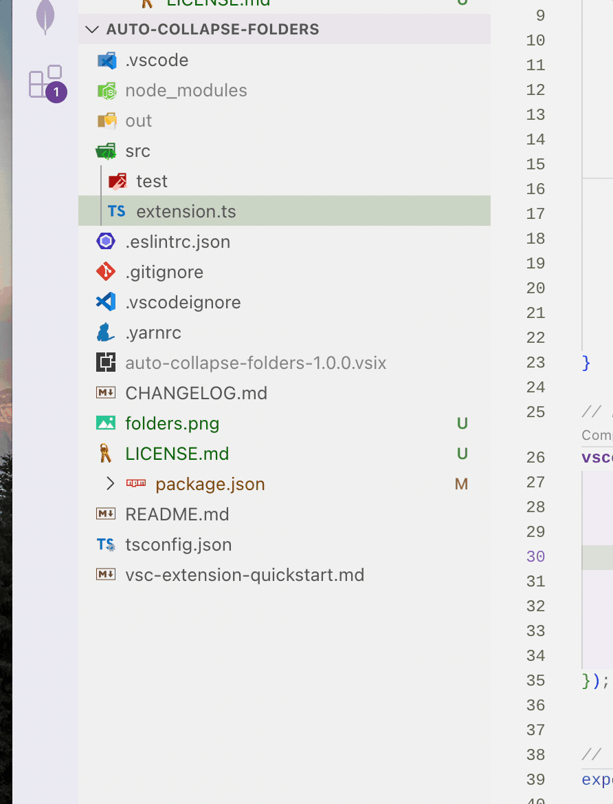

# auto-collapse-folders

## Features

This extension will automatically collapse all folders in the explorer when you switch files while keeping the current file's folder expanded.

### Demo

## Requirements

No additional requirements.

## Release Notes

### 1.0.0

Initial release
